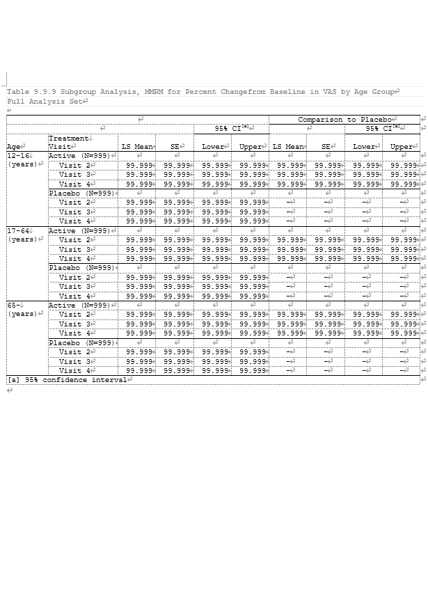

<!-- _paginate: skip -->
# CSSによるODS RTFのスタイル設定

### 第10回 大阪SAS勉強会
### 中松 建 

---
<!-- 
_paginate: skip 
_class: toc
-->
## 目次
- [はじめに](#はじめに)
- [基本的な使用方法](#基本的な使用方法)
- [応用編](#応用編)
  - [スタイル設定の再現](#スタイル設定の再現)
  - [動的な罫線の設定方法](#動的な罫線の設定方法)
  - [検証メモ](#検証メモ)
- [まとめ](#まとめ)

---
## はじめに

**Q. SASで出力のスタイル設定はどこで行うのがよい？**
- プロシージャ内
- 外部ファイル・設定

***A. コーディングのベターなプラクティスは 外部ファイル・設定***  

→ ロジック・構造とスタイルの分離  
html5でtableのrules属性の廃止など  
- コードや構造が短くシンプルになる
- 作業や責任の分担がしやすい

---

## SASでのスタイル設定

スタイルの外部設定は基本的に`proc template`

**スタイル設定できますか？ 教えられますか?**

- 設定する機会があまりない
- 設定方法に関する資料がそれほど多くない
- 他で役に立たないので、習得のモチベーションが低い

**CSS**は外部化の選択肢のひとつだが、***日本語でまとまった資料はない***
英語でも ***ODS RTFを対象にしたものはない***

---
## CSS(Cascading Style Sheet)とは
> スタイルを定義するためのルールベースの記法
> Webページやアプリケーションの文字の色や大きさ、背景、配置の設定に使用される

SAS9より前、実用的には9.4から使用可能
SASに加えてweb関連を分かる人が少なく、あまり使用されていない

→ スタイル設定の標準的な技術であり、**生成AIで扱いやすい**  
  学習コストを抑えつつ、スクレイピングやxml関連など**知識を他にも活かせる**

---
## 基本的な使用方法

```sas
* Check DOM(Document Object Model) ;
filename test temp ;

ods rtf file = test dom ;
proc report data = sashelp.class ;
run ;
ods rtf close ;

* Apply to RTF;
ods rtf file = "xxx.rtf" cssstyle = "style.css" ;
proc report data = sashelp.class ;
run ;

ods rtf close ;
```
`ods trace dom` でもOK
セルの値も出力されるので、確認時には適宜データセットを空にする

---
## DOMサンプル


```html
<table class="table">
   <colgroup>
      <col type="char">
      <col type="char">
      <col type="num">
      <col type="num">
      <col type="num">
   </colgroup>
   <thead>
      <tr>
         <th class="header" index="1">Name</th>
         <th class="header" index="2">Sex</th>
         <th class="header" index="3">Age</th>
         <th class="header" index="4">Height</th>
         <th class="header" index="5">Weight</th>
      </tr>
   </thead>
   <tbody>
      <tr>
         <td class="data" type="char" unformatted-type="char" index="1" name="_c1_" data-name="_c1_">Alfred</td>
         <td class="data" type="char" unformatted-type="char" index="2" name="_c2_" data-name="_c2_">M</td>
         <td class="data" type="num" unformatted-type="num" index="3" name="_c3_" data-name="_c3_">       14</td>
         <td class="data" type="num" unformatted-type="num" index="4" name="_c4_" data-name="_c4_">       69</td>
         <td class="data" type="num" unformatted-type="num" index="5" name="_c5_" data-name="_c5_">    112.5</td>
      </tr>
   </tbody>
</table>
```

---
**生成AIへの指示例**

> DOMにスタイルを設定するためのCSSを作成します。
> - tableの上と下に線
> - ヘッダーのセルには下線
> - ヘッダーの文字は太字
> 
> を、以下のDOMに対して行うためのCSSを作成してください。
> スタイルの設定対象はクラスが設定されているエレメントで、クラスを含めて指定してください。
> \---
> {DOM}

---
##  応用編


---
## スタイル設定の再現

[ODS機能とREPORTプロシジャを用いた解析帳票の作成(SAS ユーザー総会2017)](https://www.sas.com/content/dam/SAS/ja_jp/doc/event/sas-user-groups/usergroups2017-b-11-02.pdf)
のデータ・コードを使用し、設定例を再現




---
## 再現用SASコード

```sas
options nodate nonumber papersize = "A4" orientation = portrait topmargin = 3cm bottommargin = 3cm leftmargin = 2.5cm rightmargin= 2.5cm ;
ods escapechar = '~';

title1 'Table 9.9.9 Subgroup Analysis, MMRM for Percent Change from Baseline in VAS by Age Group' ;
title2 'Full Analysis Set' ;
footnote1 'Page ~{pageof}' ;

ods rtf file = out  notoc_data cssstyle = css dom ;
proc report data = sample.out missing split = '|' spanrows ;
  column ("" AGEGR1N AGEGR1X TRTPN TRT_VISITN TRT_VISIT LSMEAN SE)
         ("95% CI~{super[a]}" LOWER UPPER)
         ("Comparison to Placebo" C_LSMEAN C_SE("CI~{super[a]}" C_LOWER C_UPPER)) 
         ;
  define AGEGR1N    / order noprint ;
  define AGEGR1X    / order 'age' ;
  define TRTPN      / order noprint ;
  define TRT_VISITN / order noprint ;
  define TRT_VISIT  / 'Treatment|Visit' ;
  define LSMEAN     / 'LS Mean' ;
  define SE         / 'SE' ;
  define LOWER      / 'Lower' ;
  define UPPER      / 'Upper' ;
  define C_LSMEAN   / 'LS Mean' ;
  define C_SE       / 'SE' ;
  define C_LOWER    / 'Lower' ;
  define C_UPPER    / 'Upper' ;

  compute after _page_ ;
    line '[a] 95% confidence interval' ;
  endcomp ;
run ;
ods rtf close ;
```

---
## CSS例
```css
:root{
  font-size:8pt;
  font-family: 'Courier';
} 

.systemtitle, .systemtitle2,.systemtitle3, 
.linecontent{text-align:left;}
.systemfooter{text-align:right;}
.linecontent:first-child{border-top-width:1pt;}

.table{
    border-color:black;
    border-style:solid;
    border-top-width:1pt;
    width: 100% ;
}

.table.header, .table.data{
    padding: 0 ;
    margin: 0 ;
}

.data{vertical-align:top;}
```

```css
.header{
    vertical-align:bottom;
    text-align: resolve('%head_align') ;
}
.header:not(:empty){border-bottom-width: 1pt;}

td.data:not(:empty){padding-left: resolve('%col_margin') ;}

.data:empty, th.data{border-top-width: 1pt;}
td.data:not(:empty){border-top-width:resolve('%group_line');}

/*
macro sample for dynamic property
%macro col_margin ;
  %if "%scan(&_val_, 1)" = "Active" or "%scan(&_val_, 1)" = "Placebo"
  %then 0 ;
  %else 0.4cm ; 
%mend ;
*/


```
---
## 動的な罫線の設定方法

- ~~モダンCSS :has()など~~
- ~~後続兄弟結合子 th.data ~ td.data~~
- ~~動的プロパティで_row_の参照~~
- セルのルール + 動的プロパティで_val_の参照: style.css
- マクロでCSSの:nth-child()を生成: css_macro.sas
- 従来どおり call define

---
## 検証メモ

- cssclassによるクラス追加はrtfでは使用できない(htmlでもログのdomには出てこないことに注意)
- CSSは独自の規格のようで、いわゆるモダンCSSと呼ばれる機能や非表示化や優先設定なども使用できない 
- 擬似クラス(Pseudo-Class)は有用だが、rtfでは後続兄弟結合子「~」など一部うまく機能しないものもある
  → おそらくrtfで存在する要素にはクラスが指定されている、その要素にしかスタイルの指定は効かない
- SASのバージョンによりDOMが変わる場合があるので注意

---
- noprintの列は擬似クラスでの参照はできない
- noprintの代わりにCSS側での非表示化も不可
- :before によるフォント情報などの埋め込みもおそらく不可
- first-xxはあるがlast-xxは使用できない、nth-childは下層すべてが対象になるが、first-xxでは前方の一部しか対象にならない
- 表全体の下線はフットノートの形式にもよるが、例のような形式で罫線にnth-childを使わずフットノートなしの場合、空のlineでの対応が簡単
- プロパティでのマクロ変数やマクロの使用で、セレクタが不自由な点はいくらかカバー可能
- 動的プロパティでは`_col_` や `_row_` はうまく動作せず、確認できたのは`_val_`のみ
- proc reportで特定の複数列にタイトルをつけるような場合、cssで`_val_`の値を扱う場合`("" col1 col2)`のように、空でもタイトルの指定が必要 

---
## まとめ

- テーブル全体の設定であれば、十分対応可能
- 列・行への設定は番号を指定する形で可能
- 罫線など動的な設定は、CSSの生成や動的プロパティが必要

リファレンス：[ODS and Cascading Style Sheets](https://documentation.sas.com/doc/ja/pgmsascdc/9.4_3.5/odsadvug/p15c42wln5l6een1cxclxtcxncsm.htm)

使用可能なCSSの機能は限定的ではあるものの
**生成AIにより学習コストが低い**(高精度な回答が得られる)  

- プロシージャ内指定からの次のステップ
- proc templateに関して詳しい人がいない
- 既存の資産や参照プログラムがない

***というような場合には有用では？***

---
## 配布先
https://github.com/k-nkmt/sas_study_group/tree/main/Osaka_10th
```
├─prg
│  │  css_macro.sas : CSS関連マクロ
│  │  css_report.sas :  レポート用コード
│  │  style.css : サンプルCSS
│  │
│  ├─data : テスト用データ 
│  └─report: サンプル出力
├─.vscode : marp用設定
└─slide
       theme.css : スライドのカスタムテーマ
       slide.md : スライドのソース
```

---
## その他資料など

- スライドは[Marp](https://marp.app/)とカスタムテーマにより作成、CSSのサンプルとして同梱

- [SAS単体でUUID(バージョン3,5)を生成する処理](https://github.com/k-nkmt/sas_uuid)
バイナリ関連関数によりUUIDバージョン3, 5を生成

- [Intro to SAS Notes 日本語訳](https://k-nkmt.github.io/Intro_to_SAS_Notes_ja/README.html)
University of Florida College of Public Health and Health Professionsが公開しているSASのテキストの日本語訳

- Githubアカウント: https://github.com/k-nkmt
- e-mail: ken-nakamatsu@knworx.com