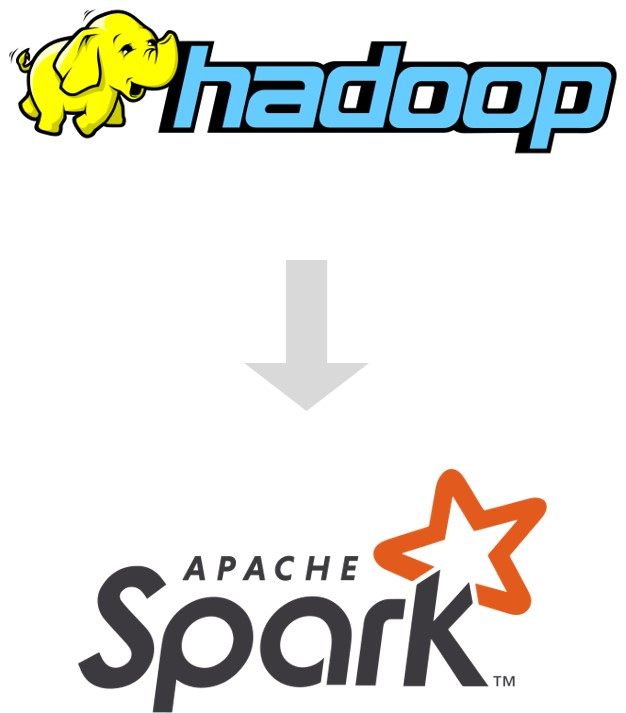

<!-- _paginate: skip -->
# Apache と データフォーマット の紹介

### 第11回 大阪SAS勉強会
### 中松 建 


---
<!-- 
_paginate: skip 
_class: toc
-->
## 目次
- [はじめに](#はじめに)
- [Apacheソフトウェア財団](#Apacheソフトウェア財団)
- [Apacheライセンス](#Apacheライセンス)
- [Hadoopと分散処理](#Hadoopと分散処理)
- [データフォーマット](#データフォーマット)
- [Parquetと公式のSASコード](#Parquetと公式のSASコード)
- [Arrow:構成](#Arrow:構成)
- [Arrow:特徴](#Arrow:特徴)
- [より詳しく知りたい人へ](#より詳しく知りたい人へ)
- [過去資料など](#過去資料など)

---
## はじめに

- 最近のデータフォーマットについて、もう少しよく知っておきたい 
    - 後半に詳しく知りたい人向けの内容

- 前半に背景的な説明などを追加
  似たようなプロジェクト、いろいろな機能が含まれていたりする
  データインフラの専門ではないので、誤りなどがあればご指摘ください

---
## Apacheソフトウェア財団

[Apache Software Foundation](https://www.apache.org/)
- **OSSで有名**: 多くのオープンソースソフトウェアを提供
- **高い信頼性**: 大規模な体制、OracleやNetflixなど企業からのプロジェクト寄贈も多い
- **幅広い利用**: Apache HTTP Serverは最近でも25%以上のシェア
                  httpサーバーやjavaライブラリなどSAS製品にも含まれている

---
## Apacheライセンス


https://www.apache.org/licenses/LICENSE-2.0

- MITライセンスなどより厳格
- ***商標***、***特許***、***帰属***などが定義されていて、***企業が使用しやすい***
  -> SAS社のリポジトリでも使用

コミットする際に帰属の確認のため、**サインオフ**が必要なことがある

---
## Hadoopと分散処理

**Hadoop**：大規模データを蓄積・分析するための分散処理フレームワーク
- 分散処理(mapreduce)
- ファイルシステム(HDFS)  

SASでも proc hadoopがある

最近では
- 分散処理 → Spark
- HDFS → Amazon S3など

- データ基盤製品(Databricks、Snowflake)
- 強化されたローカル処理 + 高性能なデータフォーマット

---
## データフォーマット

CSV・Jsonなどの非効率性から開発

#### ファイル
- Avro(2010) メタデータが扱いやすい・行指向
- ***Parquet***(2013) 比較的多くのシステムでサポート
- ORC(2016) 書き込みに強い

#### メモリ
- ***Arrow***(2020) 

()内はv1.0リリース年

---
## Parquetと公式のSASコード

#### SAS Viya 
2021.2.6 で parquet, ORC がlibnameエンジンでサポート
https://communities.sas.com/t5/SAS-Communities-Library/Parquet-Support-in-SAS-Compute-Server/ta-p/811733#U811733

#### saspy 
v5.100.2 で parquet の出力がサポート(ユーザーによるコミット)
https://github.com/sassoftware/saspy/releases/tag/v5.100.2
内部ではpyarrowを使用、オプションの依存関係に追加

```python
sd2pq("sh_class.parquet", table="class", libref="sashelp")
```

---
## Arrow:構成

- 標準化されたメモリ仕様
  言語や環境を問わない、中間データフレームのようなもの
  効率的なデータ交換 - 変換時にコピーが不要な場合も 

  - ファイル形式
    メモリを出力したような形式 IPC(Feather V2)

- 幅広い状況に対応したライブラリ 
  多数の言語 - C++(C Glib, MATLAB, Python, R, Ruby), C#, Go, Java, JavaScript, Julia, Rust, Swift 
  多数の形式 - CSV, Json, Parquet, ORC  ファイルシステム - HDFS, Amazon S3
 
---
## Arrow:特徴

#### 高速な処理
Sparkの処理時間が ***1/30***  
**polars**, **cudf**などのライブラリで採用  
～100GB程度までなら分散しなくても処理可能

#### Pandasの問題点の改善
Noneのサポート、 型が変わってしまう、データ交換がしづらいなど
pandas の作者 を含むチームが 開発
[Apache Arrowと「pandasの10項目の課題」- 日本語訳ページ](https://qiita.com/tamagawa-ryuji/items/3d8fc52406706ae0c144)

**pandas2.0** - 処理エンジンとして利用可能に
**pandas3.0** - 依存関係に追加予定 文字型でデフォルトに


---
<!-- 
_paginate: skip 
-->
## より詳しく知りたい方へ

---
## Arrow と Parquetの中身
[Arrow/Parquet in SAS Compute](https://communities.sas.com/kntur85557/attachments/kntur85557/SAS_Exploretkb-board/132/1/Arrow-Parquet%20in%20SAS%20Compute.pdf)よりも詳しく

- Arrow仕様
- Parquet仕様
- SASによる変換の実装例

#### 先におすすめの資料
- [文字コードの進化](https://www.docswell.com/s/6484025/KJLJWV-2024-04-05-151405)
- [小さく始める2進数](https://www.docswell.com/s/6484025/ZXEWEG-2024-10-21-162009)

以降の表記は基本的にlittle endian

---
## Arrow 仕様
Arrow: ***メモリ上*** - 余分な処理を行わない
IPC: google flatbufferによりメモリの情報をファイル化 [おすすめ解説サイト](https://kaigai.hatenablog.com/entry/2019/01/14/144040)

vtable(データ定義)
| アドレス(例) | 値      | 概要                          |
|-------------|----------|-------------------------------|
| 0x0044      | `10 00`  | vtable length = 16 bytes      |
| 0x0046      | `14 00`  | table length = 20 bytes       |
| 0x0048      | `08 00`  | field id 0: offset to string  |
| 0x004A      | `06 00`  | field id 1: nullable (bool)   |
| 0x004C      | `07 00`  | field id 2: type id (byte)    |
| ---  | ---  | ---         |

---
table(vtableに対応するデータ)
| アドレス(例) | 値          | 概要                                        |
|-------------|--------------|---------------------------------------------|
| 0x0054      | `10 00 00 00`| 32bit negative offset to vtable <br>(0x0054 - 0x0010 = 0x0044) |
| 0x0058      | `00 00`      | (padding)                                   |
| 0x005A      | `01`         | field-id 1: nullable - true                 |
| 0x005B      | `03`         | field-id 2: type-id - float                 |
| 0x005C      | `10 00 00 00`| field-id 0: offset to string(column name) <br>- 16byte  |
| ---  | ---  | ---         |

---
#### 文字型の列の例
| value |
|-------|
|ABC    |
|(null) |
|DE     |
|FG     |

### 格納される情報
|値(bit・デコード) | 概要                                     |
|------------------|------------------------------------------|
|`0D`[00001101]    |validity bitmap 右から開始, 1ならnot null |
|0,3,3,5           |オフセット                                |
|ABCDEFG           |値                                        |


---
## Parquet 仕様
Parquet: ***保存用*** - なるべく容量を削減
[Thrift](https://github.com/apache/thrift)によりスキーマを定義

SchemaElement(列の定義)のフィールドID
>  1: type, 2: type_length;, 3: FieldRepetitionType, 4: name;

|idΔ, 型| 項目                      | 値            |
|--------|---------------------------|---------------|
|`15`    | type, int32               | `0A`:double   |
|`25`    | FieldRepetitionType, int32| `02`: OPTIONAL|
|`18`    | name, byte                | 省略          |


---
#### Varintエンコーディング
可変長により小さい値で容量を節約  
継続bit + 7bit 継続bitが1なら次の7bitとあわせて読む
| 数値 | エンコード | bit                     |
|------|------------|-------------------------|
|15    | `0F`       |[0 0001111]              |
|150   | `9601`     | [1 0010110] [0 0000001] |

加えてzigzagエンコーディングで負数に対応

#### RLE/Bit-Packing Hybridエンコーディング
definition level: フィールドの深さ(欠損を表すのにも使われる) 
`10 01` : [0001000 0] 末尾0-RLE: 非欠損(`01`)が8レコード続く
`03 0D` : [0000001 1] 末尾1-bitpacking: 以下で記載

---
#### 文字型の列の例
| value |
|-------|
|ABC    |
|(null) |
|DE     |
|FG     |

#### 格納される情報

|値(bit・デコード)             |概要                                   |
|------------------------------|---------------------------------------|
|`03`[0000001 1] `0D`[00001101]|definition level: 1バイトのビットマップ|
|3 ABC 2 DE 2 FG               |文字数・値                             |

---
## SASによる変換の実装例

仕様に沿えばBaseSASでも変換が一応可能  
https://github.com/k-nkmt/sas_study_group/tree/main/Osaka_11th

**SAS → Parquet, Arrow IPCに変換**  
- 文字型と数値型(Double)の変数名と値のみを対象
- ファイルサイズより単純化を優先
- 実行速度より読みやすさを優先、可能な箇所はproc streamを使用
- 固定値(ファイル仕様、仕様からのバイト数)の説明は多すぎるのでなし
- Readmeを確認の上で利用をお願いします

---
## コード実行例
[example.ipynb](https://github.com/k-nkmt/sas_study_group/blob/main/Osaka_11th/example.ipynb) 


---
## 過去資料など

- [CSSによるODS RTFのスタイル設定 ](https://www.docswell.com/s/6484025/KJ4X4J-2024-10-21-172825)
  第10回 大阪SAS勉強会
- [SASでUUID(バージョン3,5)を生成する処理](https://github.com/k-nkmt/sas_uuid)
  Base SASだけで仕様からUUIDバージョン3, 5を生成
- [langchain, langgraphでのSAS利用例](https://github.com/k-nkmt/SAS_as_Tool_Examples)
  2024年 SASユーザー総会 

- [Intro to SAS Notes](https://k-nkmt.github.io/Intro_to_SAS_Notes_ja/README.html)
  University of Florida College of Public Health and Health Professions が公開しているテキストの翻訳


- Githubアカウント: https://github.com/k-nkmt
- e-mail: ken-nakamatsu@knworx.com